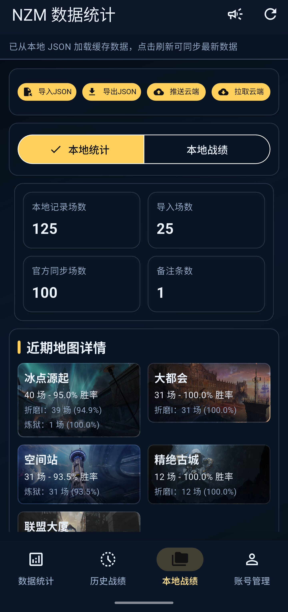
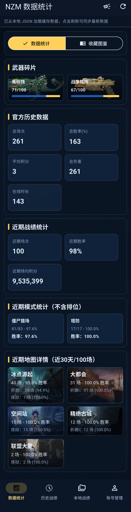
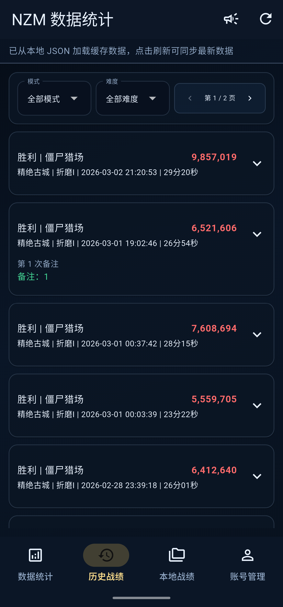
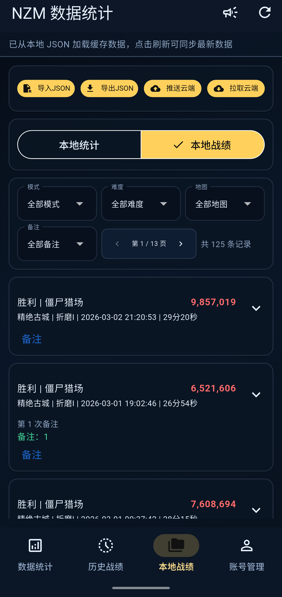

# NZM 数据统计 (Flutter)

Flutter 版 NZM 数据统计客户端，功能对齐 Electron 端，面向移动端使用场景。

## 功能概览

- 底部主导航：
  - 数据统计
  - 历史战绩
  - 本地战绩
  - 我的
- 数据统计支持 5 个核心模块：
  - 官方历史数据
  - 近期战绩统计
  - 近期模式统计（不含排位）
  - 近期地图详情（近 30 天 / 100 场）
  - 武器碎片进度
- 本地能力：
  - JSON 导入 / 导出
  - 本地统计与本地战绩
  - 备注功能（纯文本、自动计算第 N 次备注）
- 云同步：
  - 七牛配置
  - 上传 / 拉取本地记录

## 下载

### 获取token工具下载

- OneDrive：[点我下载]<https://1drv.ms/u/c/1ebfb8cb31d9e48a/IQAnCJV8iVLoR5wb9IWGpL_bAeyPHND3ZTXBUyP8eUuxisg?e=DkkS1I>
- 移动云盘：[点我下载]<https://yun.139.com/shareweb/#/w/i/2sUfJiUmha9p0>

### 工具apk 下载

- OneDrive：[点我下载]<https://1drv.ms/u/c/1ebfb8cb31d9e48a/IQCzPovXzxd7RbBLLTTmBHdsARE8mHuqIZ_-YwNCjPl1JPA?e=noZxHe>
- 移动云盘：[点我下载]<https://yun.139.com/shareweb/#/w/i/2tyao86BR1Sjq>

## 环境要求

- Flutter SDK: `>=3.3.0 <4.0.0`
- Dart SDK: 与 Flutter 版本匹配
- Android Studio / VS Code + Android SDK
- 注意sdk路径切换

## 快速启动

```bash
flutter pub get
flutter run
```

## 打包

```bash
flutter build apk --release
```

产物路径：

- `build/app/outputs/flutter-apk/app-release.apk`

## 目录说明

- `lib/`: 业务代码（页面、控制器、服务）
- `assets/`: 资源文件（图标等）
- `android/`, `ios/`: 原生平台工程

## 数据与安全说明

- 账号信息、本地记录、七牛配置保存在本地设备。

## 功能截图








## 免责声明

本项目仅用于学习和个人研究，非官方客户端。

## 赞助

- 微信赞助  
  
- 支付宝赞助  
  
